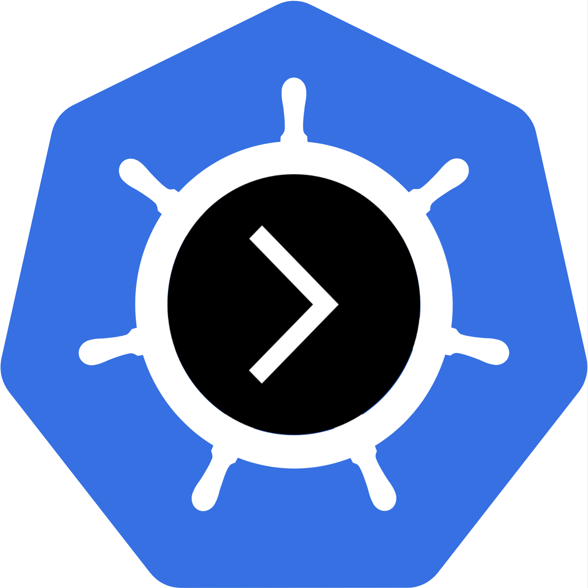

#  Kdo: deployless development on Kubernetes
[](https://github.com/stepro/kdo/actions?query=workflow%3Akdo)
[](https://github.com/stepro/kdo/issues?q=is%3Aopen+is%3Aissue+label%3Afeature-request+sort%3Areactions-%2B1-desc)
[](https://github.com/stepro/kdo/issues?q=is%3Aopen+is%3Aissue+label%3Abug)

Kdo is a command line tool that enables developers to run, develop and test code changes in a realistic deployed setting without having to deal with the complexity of Kubernetes deployment and configuration.

With Kdo, you can:

- run a command in a Kubernetes cluster **without any deployment**;
- build and use a custom image to run a command **without any registry**;
- inherit pod configuration from an existing workload **instead of deploying**;
- replace existing pods while running a command to **evaluate end-to-end behavior**.

Kdo can also be used for longer-running connected development sessions where local file updates are pushed into the running container, enabling rapid iteration on code while continuing to run as a properly configured container in the Kubernetes cluster.

## Prerequisites and Installation

Kdo requires the `kubectl` CLI to communicate with a Kubernetes cluster and the `docker` CLI to perform dynamic image builds, so first make sure you have these installed and available in your PATH. Then, download the latest [release](https://github.com/stepro/kdo/releases) for your platform and add the `kdo` binary to your PATH.

By default `kdo` utilizes the current `kubectl` context, so point it at the Kubernetes cluster of your choice and you're good to go!

## Quickstart

Take a look at the [TODO application sample](samples/todo-app).

## Examples

Run a command shell in an `alpine` container:

```
kdo -it alpine
```

Run a DNS lookup in an `alpine` container:

```
kdo -it alpine nslookup kubernetes.default.svc.cluster.local
```

Run a Node.js app in a container built from the current directory:

```
kdo . npm start
```

Run the default command in a container built from the current directory that inherits configuration from the first container defined by the pod template in the `todo-app` deployment spec:

```
kdo -c deployment/todo-app .
```

Run a command shell in a container built from the current directory that inherits existing configuration from the first container defined by the first pod selected by the `todo-app` service, and also push any changes in the current directory to the container's `/app` directory:

```
kdo -c service/todo-app -s .:/app -it . sh
```

Debug a Node.js app in a container built from the current directory that inherits existing configuration from the first container defined by the `todo-app-56db-xdhfx` pod, and forward TCP connections made to local ports `8080` and `9229` to container ports `80` and `9229` respectively:

```
kdo -c todo-app-56db-xdhfx -p 8080:80 -p 9229:9229 . node --inspect-brk=0.0.0.0:9229 server.js
```

Run the default command in a `kdo-samples/todo-app` container that inherits its configuration from the `web` container defined by the pod template in the `todo-app` deployment spec, and also overlay any existing pods produced by that same deployment:

```
kdo -c deployment/todo-app:web -R kdo-samples/todo-app
```

## Usage

Kdo is a single command CLI that can be called in a small number of unique ways:

```
kdo [flags] image [command] [args...]
kdo [flags] build-dir [command] [args...]
kdo --[un]install [-q, --quiet] [-v, --verbose] [--debug]
kdo --version | --help
```

When called with an `image` parameter, this represents an existing image to be run in the Kubernetes cluster. This is distinguished from the `build-dir` parameter, which always starts with `.` and identifies a local build context for a custom image to run in the Kubernetes cluster.

When the `command` parameter is set, this configures the `command` property in the container and removes the `args` property.

When called with the `--install` or `--uninstall` flag, all other flags with the exception of those listed above are ignored and no positional parameters are allowed.

## Flags

Kdo can be customized in a variety of ways through a set of command line flags.

### Kubernetes flags

These flags customize how the `kubectl` CLI is used.

Flag | Default | Description
---- | ------- | -----------
`--kubectl` | `kubectl` | path to the kubectl CLI
`--kubeconfig` | `<empty>` | path to the kubeconfig file to use
`--context` | `<empty>` | the kubeconfig context to use
`-n, --namespace` | `<empty>` | the kubernetes namespace to use
`--kubectl-v` | `0` | the kubectl log level verbosity

### Installation flags

These flags are used to manage the kdo server components. These components are installed into the `kube-system` namespace as a daemon set, so using these flags requires administrative access to the Kubernetes cluster.

Flag | Description
---- | -----------
`--install` | install server components and exit
`--uninstall` | uninstall server components and exit

Normally the server components are installed automatically as needed, but this is not possible if the user does not have permission to install into the `kube-system` namespace. In that case, an alternative administrative user can use the `--install` flag to manually configure the cluster for other users.

The `--uninstall` flag can be used to explicitly remove any leftover kdo pods across all namespaces in addition to the server components from a cluster.

### Scope flag

The scope flag (`--scope`) can be used to change how kdo pods are uniquely named. By default, the local machine's hostname is used.

The scope value is combined with the `image` or `build-dir` parameter and any value of the `--inherit` flag, then SHA-1 hashed to produce the final pod identifier.

### Build flags

These flags customize how the `docker` CLI is used when building images.

Flag | Default | Description
---- | ------- | -----------
`--docker` | `docker` | path to the docker CLI
`--docker-config` | `<empty>` | path to the docker CLI config files
`--docker-log-level` | `<empty>` | the docker CLI logging level
`-f, --build-file` | `<build-dir>/Dockerfile` | dockerfile to build
`--build-arg` | `[]` | build-time variables in the form `name=value`
`--build-target` | `<empty>` | dockerfile target to build

When the `docker` CLI is invoked, it does not use the default configured Docker daemon. Instead, it uses the kdo server components to directly access the Docker daemon running on a node in the Kubernetes cluster. Therefore, it is theoretically not a requirement that the local machine is actually running Docker, although in most cases (e.g. Docker Desktop) this will be the case. It **is**, however, a requirement that the node on which the kdo pod is scheduled is using Docker for its container runtime and the Docker daemon socket at `/var/run/docker.sock` on the host can be volume mounted into the pod.

### Configuration flags

These flags customize the pod and container that runs the command.

Flag | Default | Description
---- | ------- | -----------
`-c, --inherit` | `<none>` | inherit an existing configuration
`--label` | `[]` | set pod labels in the form `name=value`
`--annotate` | `[]` | set pod annotations in the form `name=value`
`--no-lifecycle` | `false` | do not inherit lifecycle configuration
`--no-probes` | `false` | do not inherit probes configuration
`-e, --env` | `[]` | set container environment variables in the form `name=value`
`-R, --replace` | `false` | overlay inherited configuration's workload

The `-c, --inherit` flag inherits an existing configuration from a container specification identified in the form `[kind/]name[:container]`, where `kind` is a Kubernetes workload kind (`cronjob`, `daemonset`, `deployment`, `job`, `pod`, `replicaset`, `replicationcontroller` or `statefulset`) or `service` (default is `pod`). If the `kind` is not `pod`, the pod spec is based on the template in the outer workload spec, except in the case of `service`, when it is based on the workload that originally generated the first pod selected by the service. If `container` is not specified, the first container in the pod spec is selected. Init containers are not supported.

Note that even when inheriting an existing configuration, pod labels and annotations are *not* inherited to prevent the Kubernetes cluster from misunderstanding the role of the pod (for instance, automatically being added as an instance behind a service). The `--label` and `--annotate` flags can be used to re-add any labels and annotations that must be included for the pod to function properly.

When inheriting an existing configuration, there are cases when the existing pod lifecycle and probe configuration are not implemented, would cause problems, or are entirely irrelevant for the scenario. The `--no-lifecyle` and `--no-probes` flags can be used to ensure these properties are not inherited.

The `-e, --env` flags set environment variables, and in the case of an inherited configuration, override any inherited environment variables.

The `-R, --replace` flag only applies when the inherited configuration is from the `deployment`, `replicaset`, `replicationcontroller` and `statefulset` workload kinds, or from the `service` kind. For workloads, this flag scales the workload instance to zero for the duration of the command. For services, this flag changes the pod selector to select the kdo pod for the duration of the command.

### Session flags

These flags customize behavior that applies for the duration of the kdo process.

Flag | Default | Description
---- | ------- | -----------
`-s, --sync` | `[]` | push local file changes to the container in the form `[localdir:]remotedir`
`-p, --forward` | `[]` | forward local ports to container ports in the form `[local:]remote`
`-l, --listen` | `[]` | forward container ports to local ports in the form `remote[:local]`

The `-s, --sync` flag is only valid when using the `build-dir` parameter. It enables synchronization of changes in directories under the local build context into an appropriate directory in the container. For example, `--sync /app` synchronizes the entire build context to the `/app` directory in the container, while `--sync src:/app/src` synchronizes only the `src` directory to the `/app/src` directory in the container. The local directory must be relative to the build context and defaults to `.`, while the remote directory must be an absolute path to a directory in the container.

The `-p, --forward` flag enables the local machine to access specific container ports, for example, `--forward 8080:80` will forward local port `8080` to container port `80`.

The `-l, --listen` flag enables code running in the container to access specific localhost ports that are forwarded back to the local machine. This can be used to replace external dependencies, such as data stores, used by the code running in the container, with an alternate endpoint on the local machine. For instance:

```
# Start a local Mongo database that can be accessed at localhost:27017
docker run -p 27017:27017 -d mongo:4

# Build and run a web server image in Kubernetes, forwarding local port
# 8080 to container port 80, and when the web server code connects to a
# Mongo database using the MONGO_CONNECTION_STRING environment variable,
# proxy the connection back to local port 27017.
kdo -p 8080:80 -e MONGO_CONNECTION_STRING=localhost:27017 -l 27017:27017 .
```

The `-s, --sync`, `-p, --forward` and `-l, --listen` flags cannot be combined with the `-d, --detach` flag.

### Command flags

These flags customize how the command is run.

Flag | Default | Description
---- | ------- | -----------
`-x, --exec` | `false` | execute command in an existing pod
`-k, --prekill` | `[]` | kill existing processes prior to an exec
`-i, --stdin` | `false` | connect standard input to the container
`-t, --tty` | `false` | allocate a pseudo-TTY in the container

When using the `-x, --exec` flag, build, configuration and session flags are ignored with the exception of the `-c, --inherit` flag which is used to help identify the target container, and the `-p, --forward` flag. Additionally, this flag cannot be combined with the `-d, --detach` or `--delete` flags.

The `-k, --prekill` flag can be used with the `-x, --exec` flag to pre-kill existing processes by name that may be running in the container. This requires the `pkill` command in the container, and it sends a SIGKILL to all processes matching the specified flag values.

### Detached pod flags

These flags relate to running a pod in the background.

Flag | Default | Description
---- | ------- | -----------
`-d, --detach` | `false` | run pod in the background
`--delete` | `false` | delete a previously detached pod

These flags cannot be combined.

### Output flags

These flags customize how kdo outputs information.

Flag | Default | Description
---- | ------- | -----------
`-q, --quiet` | `false` | output no information
`-v, --verbose` | `false` | output more information
`--debug` | `false` | output debug information

If multiple of these flags are specified, the `-q, --quiet` takes highest precedence, followed by the `--debug` and `-v, --verbose` flags in that order.

### Other flags

Flag | Default | Description
---- | ------- | -----------
`--version` | `false` | show version information
`--help` | `false` | show help information

## License

Kdo is licensed under the [MIT](LICENSE) license.
